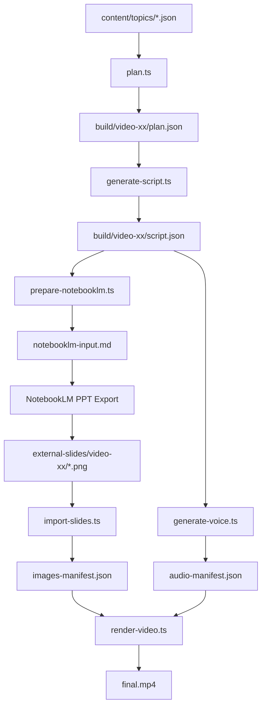

# Architecture

## Pipeline Components

- `plan.ts`: Generates per-video shot plan from style guide and topic files.
- `qa.ts`: Validates generated plan consistency and constraints.
- `generate-script.ts`: Produces narration and onscreen text per segment.
- `prepare-notebooklm.ts`: Creates NotebookLM-friendly prompt package.
- `import-slides.ts`: Imports exported slide images as segment assets.
- `generate-voice.ts`: Produces segment audio and merged narration.
- `render-video.ts`: Builds subtitles and renders MP4 via FFmpeg.

## Data Flow

## Sync Strategy

- Subtitle cue timing is derived from `audio-manifest.json` segment durations.
- Slide switching uses the same duration timeline to avoid drift.
- Rendering applies fixed 9:16 canvas and normalized slide scaling.
